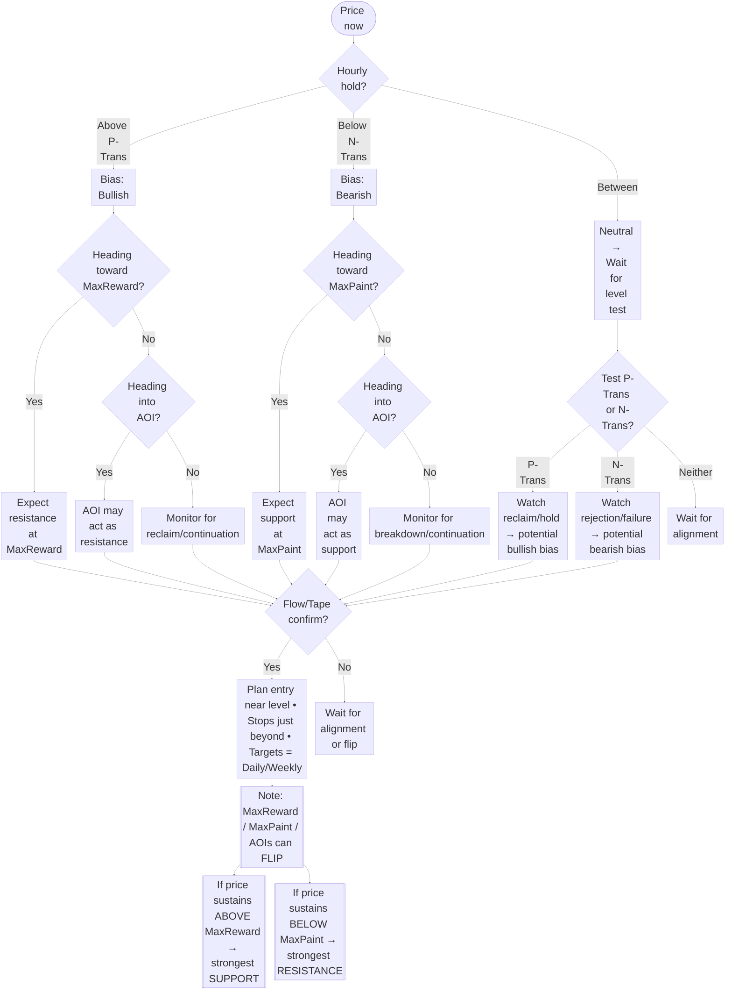

# 🔑 Key Levels

Key Levels are the foundation of the Gextron framework. They highlight **where price is likely to pause, reverse, or accelerate** based on option-premium dynamics and market-maker hedging.

<Callout type="info" title="Quick summary">
Use **P-Trans / N-Trans** to set bias, **Gamma walls** to spot support/resistance, and combine with **Option Flow + Tape** for confirmation.
</Callout>

---

## See it in the app

<Columns cols={1}>
  <Frame caption="META key levels">
    
  </Frame>
</Columns>

## What each level means

<AccordionGroup>
  <Accordion title="P-Trans (Positive Transition)" defaultOpen>
    The **bullish trigger level**.  
    • Price holding **above P-Trans** signals bullish bias.  
    • Confirmation is stronger when the **hourly time frame** is also holding above.  
    • **How to identify:** P-Trans is the **first positive bar**, and the next **three strikes to the right** must also be positive.  
  </Accordion>

  <Accordion title="N-Trans (Negative Transition)">
    The **bearish trigger level**.  
    • Price holding **below N-Trans** signals bearish bias.  
    • Stronger confirmation when the **hourly timeframe** is also holding below.  
    • **How to identify:** N-Trans is the **first negative bar**, and the next **three strikes to the left** must also be negative.  
  </Accordion>

   <Accordion title="MaxReward (tallest positive bar)">
    The **tallest positive bar** in the distribution.  
    • When price is moving **toward** MaxReward, it can act as the **largest resistance**.  
    • If price **gets above and sustains** above MaxReward, it can **flip to the biggest support**.  
    • Levels can **flip**: don’t assume permanent resistance.
  </Accordion>

  <Accordion title="MaxPaint (tallest negative bar)">
    The **tallest negative bar** in the distribution.  
    • When price is moving **toward** MaxPaint, it can act as the **largest support**.  
    • If price **breaks below and sustains** below MaxPaint, it can **flip to the biggest resistance**.  
    • Levels can **flip**: not always support-only.
  </Accordion>

  <Accordion title="Areas of Interest (AOIs)">
    **Tall bars** on the chart that highlight important zones.  
    • AOIs can act as **support or resistance**, depending on context.  
    • Example: If price is **rising into** an AOI, it may act as resistance.  
    • If price is **falling into** an AOI, it may act as support.  
    • Like MaxReward and MaxPaint, AOIs can also **flip roles** based on price action.
  </Accordion>
</AccordionGroup>

<Callout type="info" title="Strength matters">
  Not all support/resistance levels are created equal.

  Gextron **measures the strength** of each level based on option-premium dynamics, so you can quickly see which zones are **strong walls** versus weaker areas that may flip.
</Callout>

---

## Simple decision flow

---

## What to read next

<Columns cols={2}>
  <Card title="Price Targets" icon="bullseye" href="/features/price-targets">
    Set exits in advance using daily/weekly targets.
  </Card>
  <Card title="Option Flow" icon="arrows-left-right" href="/features/option-flow">
    Confirm whether big players support your bias.
  </Card>
  <Card title="Tape Reading" icon="chart-line" href="/features/tape">
    Time entries using real-time prints, sweeps, and blocks.
  </Card>
</Columns>
