# 🔑 Key Levels

Key Levels are the foundation of the Gextron framework. They highlight **where price is likely to pause, reverse, or accelerate** based on option-premium dynamics and market-maker hedging.

<Callout type="info" title="Quick summary">
Use **P-Trans / N-Trans** to set bias, **Gamma walls** to spot support/resistance, and combine with **Option Flow + Tape** for confirmation.
</Callout>

---

## See it in the app

<Columns cols={2}>
  
  
</Columns>

---

## What each level means

<AccordionGroup>
  <Accordion title="P-Trans (Positive Transition)" defaultOpen>
    The **bullish trigger level**.  
    • Price holding **above P-Trans** signals bullish bias.  
    • Confirmation is stronger when the **hourly time frame** is also holding above.  
    • **How to identify:** P-Trans is the **first positive bar**, and the next **three strikes to the right** must also be positive.  
    • Example: If **563** is the first positive bar and the next three strikes (564, 565, 566) are also positive, then **563 is P-Trans**.  
  </Accordion>

  <Accordion title="N-Trans (Negative Transition)">
    The **bearish trigger level**.  
    • Price holding **below N-Trans** signals bearish bias.  
    • Stronger confirmation when the **hourly timeframe** is also holding below.  
    • **How to identify:** N-Trans is the **first negative bar**, and the next **three strikes to the left** must also be negative.  
    • Example: If **558** is the first negative bar and the next three strikes (557, 556, 555) are also negative, then **558 is N-Trans**.  
  </Accordion>

   <Accordion title="MaxReward (tallest positive bar)">
    The **tallest positive bar** in the distribution.  
    • When price is moving **toward** MaxReward, it can act as the **largest resistance**.  
    • If price **gets above and sustains** above MaxReward, it can **flip to the biggest support**.  
    • Levels can **flip**: don’t assume permanent resistance.
  </Accordion>

  <Accordion title="MaxPaint (tallest negative bar)">
    The **tallest negative bar** in the distribution.  
    • When price is moving **toward** MaxPaint, it can act as the **largest support**.  
    • If price **breaks below and sustains** below MaxPaint, it can **flip to the biggest resistance**.  
    • Levels can **flip**: not always support-only.
  </Accordion>

  <Accordion title="Areas of Interest (AOIs)">
    **Tall bars** on the chart that highlight important zones.  
    • AOIs can act as **support or resistance**, depending on context.  
    • Example: If price is **rising into** an AOI, it may act as resistance.  
    • If price is **falling into** an AOI, it may act as support.  
    • Like MaxReward and MaxPaint, AOIs can also **flip roles** based on price action.
  </Accordion>
</AccordionGroup>

<Callout type="warning">
Always confirm with **sweeps, blocks, or sustained tape pressure** before entering.
</Callout>

---

## Simple decision flow

```mermaid
%%{init: {"themeVariables": { "fontSize": "62px", "lineHeight": "68px"}, "flowchart": { "nodeSpacing": 50, "rankSpacing": 50 }}}%%
flowchart TD
    A([Price now]) --> B{Hourly hold?}
    B -- Above P-Trans --> C[Bias: Bullish]
    B -- Below N-Trans --> D[Bias: Bearish]
    B -- Between --> E[Neutral → Wait for level test]

    C --> C1{Heading toward MaxReward?}
    C1 -- Yes --> C2[Expect resistance at MaxReward]
    C1 -- No --> C3{Heading into AOI?}
    C3 -- Yes --> C4[AOI may act as resistance]
    C3 -- No --> C5[Monitor for reclaim/continuation]

    D --> D1{Heading toward MaxPaint?}
    D1 -- Yes --> D2[Expect support at MaxPaint]
    D1 -- No --> D3{Heading into AOI?}
    D3 -- Yes --> D4[AOI may act as support]
    D3 -- No --> D5[Monitor for breakdown/continuation]

    E --> E1{Test P-Trans or N-Trans?}
    E1 -- P-Trans --> E2[Watch reclaim/hold → potential bullish bias]
    E1 -- N-Trans --> E3[Watch rejection/failure → potential bearish bias]
    E1 -- Neither --> E4[Wait for alignment]

    C2 --> F{Flow/Tape confirm?}
    C4 --> F
    C5 --> F
    D2 --> F
    D4 --> F
    D5 --> F
    E2 --> F
    E3 --> F

    F -- Yes --> G[Plan entry near level • Stops just beyond • Targets = Daily/Weekly]
    F -- No --> H[Wait for alignment or flip]

    G --> I[[Note: MaxReward / MaxPaint / AOIs can FLIP]]
    I --> J[[If price sustains ABOVE MaxReward → strongest SUPPORT]]
    I --> K[[If price sustains BELOW MaxPaint → strongest RESISTANCE]]

```

---

## Pre-market routine (first 15 minutes)

<Steps>
  <Step title="Mark levels">
    In the **first 15 minutes after market open**, mark **P-Trans**, **N-Trans**, **Areas of Interest (AOIs)**, and the **MaxReward / MaxPaint** levels. Note where **price** is relative to these.
  </Step>

  <Step title="Set bias">
    If **price is above P-Trans → bullish**.  
    If **price is below N-Trans → bearish**.  
    If **between P-Trans and N-Trans → no-trade zone** — wait for a clean reclaim or breakdown.
  </Step>

  <Step title="Plan exits">
    Start planning profit taking around **AOIs**.  
    Take **most of the profit** if price approaches one of the **Max** levels (**MaxReward** or **MaxPaint**).
  </Step>

  <Step title="Confirm with flow">
    Throughout the day, **confirm at levels** with **Option Flow** and **Tape** (look for aggressive buying/selling, sweeps, blocks) to validate the move.
  </Step>
</Steps>

---

## Playbook (fast patterns)

<Columns cols={2}>
  <Card title="Reclaim Long" icon="arrow-trend-up">
    Price reclaims **P-Trans** on volume + bullish sweeps → enter calls.  
    TP1 = **nearest daily target**; TP2 = **next wall**. Stop **just below** reclaimed level.
  </Card>
  <Card title="Fail & Fade" icon="arrow-trend-down">
    Price rejects **call Gamma wall** or **N-Trans** with bearish sweeps → enter puts/short.  
    TP = **next support level or put wall**. Stop just above rejection wick.
   </Card>
</Columns>

---

## Example walkthrough

<Columns cols={2}>
  
  
</Columns>

- **Setup**: SPX opens just under **P-Trans**, first push reclaims it on volume.  
- **Confirm**: Option Flow prints **call sweeps**; Tape shows repeated hits at the ask.  
- **Trade**: Long calls near reclaim; stop just below level; trim at **daily target**.  

<Callout type="success">
If R:R is **&lt; 1:2**, skip. Aim for **≥ 1:3** when possible.
</Callout>

---

## Common mistakes

- Entering **far from** a level (poor R:R).  
- Ignoring conflicting **flow/tape** signals.  
- Overstaying beyond **targets/walls** without fresh confirmation.

---

## What to read next

<Columns cols={2}>
  <Card title="Price Targets" icon="bullseye" href="/features/price-targets">
    Set exits in advance using daily/weekly targets.
  </Card>
  <Card title="Option Flow" icon="arrows-left-right" href="/features/option-flow">
    Confirm whether big players support your bias.
  </Card>
  <Card title="Tape Reading" icon="chart-line" href="/features/tape">
    Time entries using real-time prints, sweeps, and blocks.
  </Card>
</Columns>
